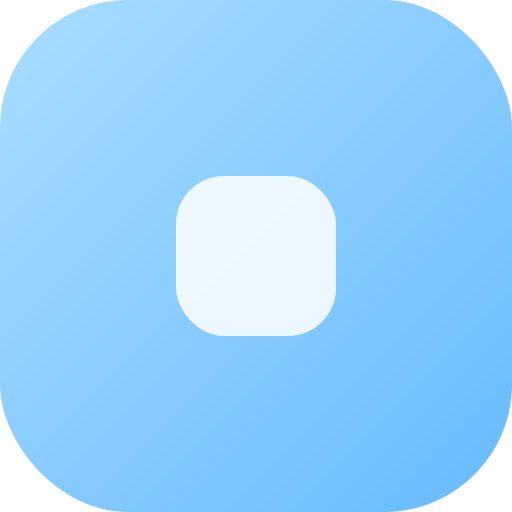

<p align="left">
  <sub><a href="README.en.md">English</a></sub>
</p>

<br />

<p align="center">
  
</p>

<h1 align="center">Sea Lantern</h1>

<p align="center">
  <strong>轻量级 Minecraft 服务器管理工具</strong>
</p>

<p align="center">
  <a href="https://github.com/SeaLantern-Studio/SeaLantern/stargazers"></a>
  <a href="https://github.com/SeaLantern-Studio/SeaLantern/network/members"></a>
  <a href="https://github.com/SeaLantern-Studio/SeaLantern/releases"></a>
</p>

<p align="center">
  <a href="https://docs.ideaflash.cn/zh/download">下载</a>
  &nbsp;·&nbsp;
  <a href="https://ideaflash.cn">官网</a>
  &nbsp;·&nbsp;
  <a href="https://deepwiki.com/SeaLantern-Studio/SeaLantern">DeepWiki</a>
</p>

<br />

## 快速开始

| 我想要……               | 前往                                                |
| ---------------------- | --------------------------------------------------- |
| 下载并安装 Sea Lantern | [下载安装](https://docs.ideaflash.cn/zh/download)   |
| 第一次创建或导入服务器 | [使用教程](https://docs.ideaflash.cn/zh/tutorial)   |
| 不知道该选择哪种服务端 | [核心获取](https://docs.ideaflash.cn/zh/server-jar) |
| 遇到使用问题或异常情况 | [常见问题](https://docs.ideaflash.cn/zh/faq)        |

## 给开发者

我们主要在 `beta` 分支上开发。如果你想参与开发，请先 Fork 仓库的 `beta` 分支，然后在自己的仓库里提交修改。

开发前需要准备：

| 依赖    | 版本     |
| ------- | -------- |
| Node.js | 22.12.0+ |
| Rust    | stable   |
| pnpm    | 11.5.3   |

如果你还没有配置开发环境，可以先查看 [环境配置](https://docs.ideaflash.cn/zh/dev/environment)。

拉取项目并切换到 `beta` 分支：

```bash
git clone https://github.com/SeaLantern-Studio/SeaLantern.git
cd SeaLantern
git switch beta
```

如果你想了解仓库结构、前后端边界和主要模块，请查看 [项目结构说明](https://docs.ideaflash.cn/zh/structure)，以及 [前端说明](frontend/README.md) 和 [后端说明](backend/README.md)。

安装依赖并启动桌面开发环境：

```bash
pnpm install
pnpm tauri:dev
```

只预览前端页面：

```bash
pnpm dev
```

只启动 HTTP / Docker 后端：

```bash
pnpm dev:http
```

如果你在 Linux 上开发，可能需要先安装 Tauri 相关系统依赖。具体请看 [Tauri Linux 前置要求](https://tauri.app/zh-cn/start/prerequisites/#linux)。

### 代码检查

提交前务必跑一次代码检查：

```bash
pnpm lint
pnpm build:check
cargo fmt --all -- --check
cargo check --workspace
cargo clippy --workspace -- -D warnings
```

更完整的开发说明见 [贡献指南](https://docs.ideaflash.cn/zh/dev/CONTRIBUTING)。

## 关于软件

Sea Lantern 使用：

- **框架**：Tauri 2
- **前端**：Vue 3
- **后端**：Rust
- **容器**：itzg/minecraft-server

我们没有使用 Electron、Node 后端或 Webpack。

Sea Lantern 依赖系统 WebView 渲染界面，轻量、响应快、可定制性高，更适合作为本地桌面工具。

## 社区与反馈

如果你在使用中遇到问题，或者想参与讨论，可以通过以下方式联系我们：

- QQ 一群：**293748695**
- QQ 二群：**1085823754**
- 问题反馈：[GitHub Issues](https://github.com/SeaLantern-Studio/SeaLantern/issues)

欢迎反馈问题、提出建议，或者分享你的使用体验。

## 参与开发

我们欢迎任何形式的贡献：代码、文档、翻译、问题反馈、功能建议，或者 UI 草图都可以。

基本流程：

1. Fork `beta` 分支
2. 新建自己的开发分支
3. 完成修改并通过基本检查
4. 提交 Pull Request

在开始之前，请先阅读 [贡献指南](https://docs.ideaflash.cn/zh/dev/CONTRIBUTING)。如果你想改动较大的功能、架构或界面，请先在 Issue 或交流群里讨论，避免做完之后方向不一致。

## AI 政策

我们不反对使用 AI 辅助开发，但提交者必须对自己的内容负责。

正如 Linux kernel 的 AI policy 所说：

> _Taking full responsibility for the contribution._

在提交 Issue 或 PR 前，请确保你理解自己的改动，并且已经实际运行、测试过最终效果。

我们不接受：

- 未经讨论的大规模重构
- 纯 AI 批量生成的 Issue / PR
- 没有复现步骤或验证结果的问题报告
- 提交者无法解释、无法维护的 AI 生成代码
- 把 AI 输出原样粘贴过来，让维护者替你判断对错

如果是架构、交互、目录结构或 UI 的大改，请先在 Issue 或交流群中讨论。

对于明显缺少人工检查，或者属于低质量 AI 生成内容（AI Slop）的 Issue / PR，我们会直接关闭。

## 许可证

[GNU General Public License v3.0](LICENSE)

## 贡献者

感谢所有为 Sea Lantern 做出贡献的人！

[](https://github.com/SeaLantern-Studio/SeaLantern/graphs/contributors)

## 致谢

Sea Lantern 是一个开源项目，遵循 GPLv3 协议。

Minecraft 是 Mojang AB 的注册商标。本项目未经 Mojang 或 Microsoft 批准，也不与 Mojang 或 Microsoft 关联。

> 我们搭建了骨架，而灵魂，交给你们。
