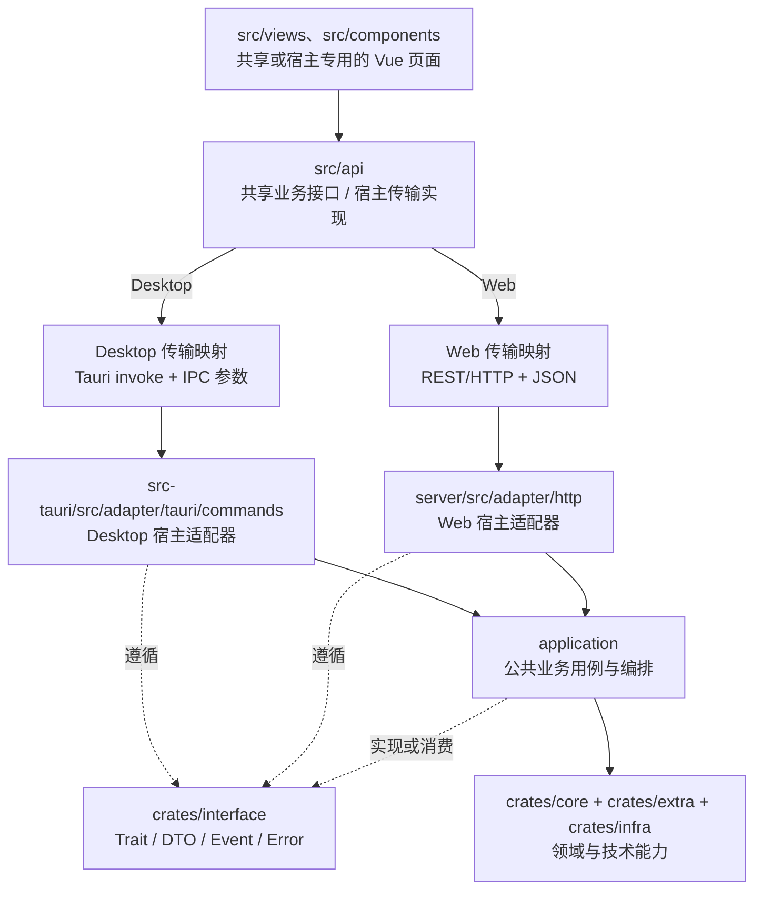
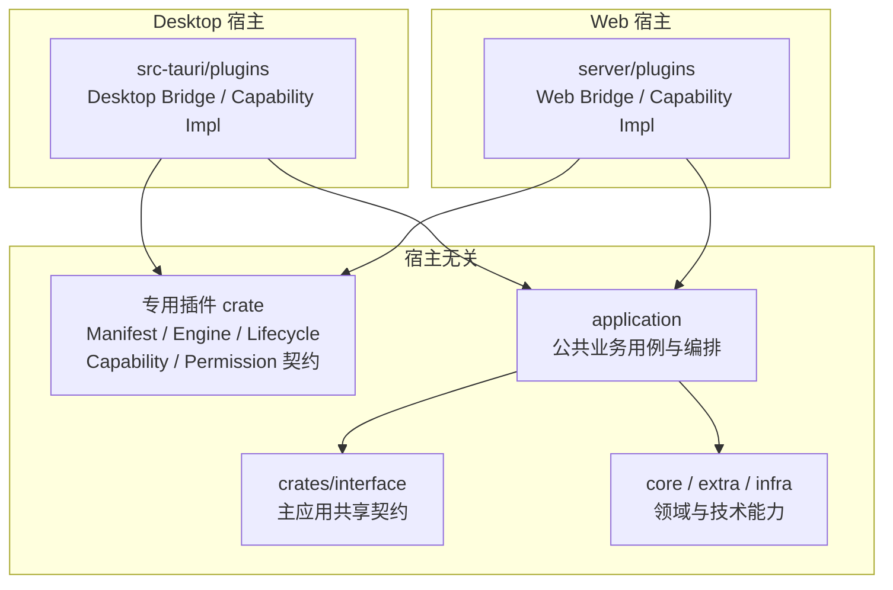
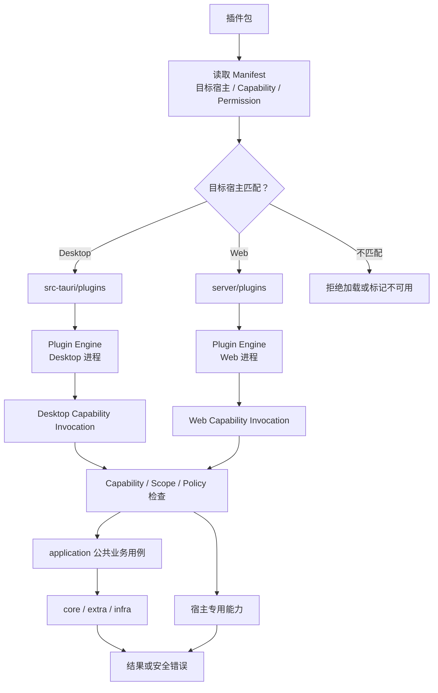
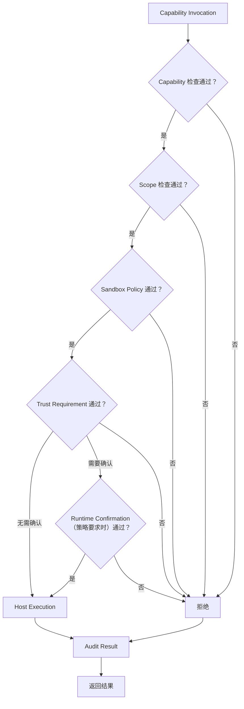

# 项目架构与代码组织

## 1. 核心原则

1. 可复用的 Vue 业务代码只依赖 `src/api`；Desktop/Web 的宿主专用页面和功能可以独立演进。
2. `src/api` 按宿主分别实现传输：Desktop 使用 Tauri IPC/Event，Web 使用 HTTP/WebSocket/SSE。
3. `src-tauri` 与 `server` 是并列宿主适配器，二者不得互相依赖。
4. `application` 是宿主无关的公共业务层，负责用例和业务编排。
5. `crates/interface` 只定义两个宿主真正共用的 Trait、DTO、Event 和 Error，不承载请求分发、业务逻辑或通信协议。
6. `core`、`extra`、`infra` 提供领域与技术能力，不感知 Tauri、Axum 或前端传输参数。
7. 普通业务不增加统一通信层或通用 RPC Runtime；插件可以使用专用 Bridge。

## 2. 总体调用结构



## 3. 目录职责

| 路径                          | 职责                                                                                           |
| ----------------------------- | ---------------------------------------------------------------------------------------------- |
| `src/views`、`src/components` | 共享或宿主专用的 Vue 页面和业务交互                                                            |
| `src/api`                     | 共享业务接口和 Desktop/Web 传输实现                                                            |
| `crates/interface`            | 两个宿主真正共用的 Trait、DTO、Event、Error                                                    |
| `application`                 | 宿主无关的业务用例和业务编排                                                                   |
| `crates/core`                 | 核心领域模型、规则、计划与进程抽象                                                             |
| `crates/infra`                | 文件、网络、持久化、平台等基础设施能力                                                         |
| `crates/extra`                | Java、市场、更新等可复用扩展能力                                                               |
| `src-tauri`                   | Desktop 进程入口、Tauri command、桌面状态、对话框、事件和本地生命周期                          |
| `server`                      | Web 进程入口、Axum REST、鉴权/RBAC、文件上传、数据库状态、工作节点/Docker 调度和 WebSocket/SSE |

## 4. 后端契约与转换边界

两个宿主共用的一次功能调用分为三类模型：

1. **传输模型**：Tauri IPC 参数或 Axum Path/Query/JSON，只存在于对应的前端传输实现和宿主适配器。
2. **标准契约模型**：放在 `crates/interface`，供两个宿主与 application 共用。
3. **领域/实现模型**：放在 `core`、`extra`、`infra`，由 application 组合和转换。

宿主适配器只负责：

- 解析传输参数；
- 处理宿主特有上下文；
- 调用 application；
- 将标准结果或错误转换为 IPC/HTTP 响应。

宿主适配器不得重新实现公共业务规则。Desktop 特有的窗口、文件选择、托盘、外部程序调用和本地事件留在 `src-tauri`；Web 特有的鉴权/RBAC、多用户、文件上传、数据库状态、工作节点/Docker 调度和 WebSocket/SSE 留在 `server`。

## 5. 依赖规则

必须保持：

```text
src-tauri ─┐
           ├─→ application ─→ core / extra / infra
server ────┘          │
                      └─→ interface

src-tauri / server ─────→ interface
```

约束：

- `src-tauri` 不依赖 `server`，`server` 也不依赖 `src-tauri`。
- `application` 不依赖 Tauri、Axum 或 Vue。
- `interface` 不定义 RPC Runtime，不依赖具体宿主。
- `core`、`extra`、`infra` 不接收 Tauri command 参数或 Axum request。
- 新增普通业务时，不得再建立通用 `method_id + JSON` 调度层。

## 6. 插件系统位置

- 插件不是基础架构的前置条件。
- 专用插件 crate 保存宿主无关的 Manifest、Engine、Lifecycle、Capability 和 Permission 契约，不包含宿主实现。
- `src-tauri/plugins` 与 `server/plugins` 分别实现 Desktop/Web 宿主能力。
- Manifest 必须声明目标宿主和所需权限；不默认保证同一插件跨宿主运行，也不向插件暴露完整宿主 Context。
- 跨宿主兼容依赖契约声明和运行时能力查询。
- 插件 Bridge 由对应宿主实现；是否使用 RPC 属于宿主实现细节，不构成主应用通用 RPC Runtime。

### 6.1 代码组织



### 6.2 Desktop/Web 调用链



### 6.3 Capability 授权与执行



## 7. 新功能落位检查

新增业务能力时，先判断它是两个宿主共用的业务，还是单一宿主专用能力。

两个宿主共用的业务按以下顺序落位：

1. 在 `interface` 定义两个宿主真正共用的输入、输出、事件和错误契约。
2. 在 `application` 实现用例与公共业务编排。
3. 分别在 `src-tauri` 和 `server` 添加薄适配器，只处理各自的传输和宿主上下文。
4. 在 `src/api` 对外暴露共享业务方法，内部按宿主映射传输。
5. 可复用页面只调用该业务方法。

单一宿主专用能力保留在对应的 `src-tauri` 或 `server` 及其前端实现中；只有可复用的业务部分才下沉到 `application`，不得为了形式统一而补造另一宿主的实现。

新增插件能力时，还必须：

1. 在 Manifest 中声明目标宿主、所需 Capability 和 Permission。
2. 所有调用经过宿主的 Capability、Scope、Sandbox、Trust 和 Audit 边界；高风险调用按策略要求 Runtime Confirmation。
3. 公共业务调用 application；宿主专用能力分别在 Desktop/Web 插件实现中完成。

---

# 迁移章节（临时，迁移完成后删除）

> 核对基线：2026-08-14，`origin/main` `96666af`

## 已完成

- `application` 已成为 Desktop/Web 共用业务层。
- `src-tauri` 与 `server` 已是并列宿主，Tauri 不依赖 Web Server。
- `src/api/rpc.ts` 已为迁移完成的方法提供“统一业务方法名 → Tauri command / Axum 路由”的双端映射。
- Web 普通业务主要使用资源式 REST。
- 插件调用拥有独立的授权 Bridge，不要求主业务进入 RPC Runtime。
- 旧 Tauri compat commands 已从主干删除。

`rpcInvoke` 当前是前端方法映射器：它把点分业务方法名映射为 Tauri command 或 Axum REST/RPC 路由。这里的命名不代表 application 或普通后端业务重新引入了通用 RPC Runtime。

## 待迁移

1. `crates/interface` 仍直接依赖并暴露部分 `core`/`extra` 类型，需要只保留两个宿主真正共用的契约。
2. 前端传输迁移尚未完成：部分业务仍直接使用旧 `tauriInvoke`，`axumRouteMap` 也只覆盖 Web 已实现能力；未映射能力会抛出 `NotImplementedError`。
3. 插件代码尚未收敛到最终的专用插件 crate。
4. `src/api/rpc.ts` 将 `server.console.send` 映射到 `/api/rpc/server/console/send`，但当前生产 Router 挂载的是 REST `/api/instances/{id}/command` 和插件 RPC；这条映射尚未闭环，旧通用 RPC 代码的去留也需要同步收口。

后续迁移应同步修改前端调用方；除非团队另行决定，不恢复已经删除的旧兼容路径。

## 插件临时位置

```text
crates/core/src/app_plugin     插件领域契约与策略类型
crates/extra/src/app_plugin    Lua Runtime、Loader、Manager
application/src/plugin         策略存储、Dispatcher、生命周期服务
src-tauri/.../commands/plugin  Desktop 插件入口
server/src/rpc/.../plugin      Web 插件 Bridge
```

目标中的独立插件 crate 尚未完成，新增代码不得继续扩大这种临时分散结构。

## 删除条件

- `interface` 只保留两个宿主真正共用的契约。
- 可复用的前端业务全部通过 `src/api` 完成双端传输映射。
- 插件代码收敛到最终目录。
- Console 调用和旧通用 RPC 代码完成收口。
