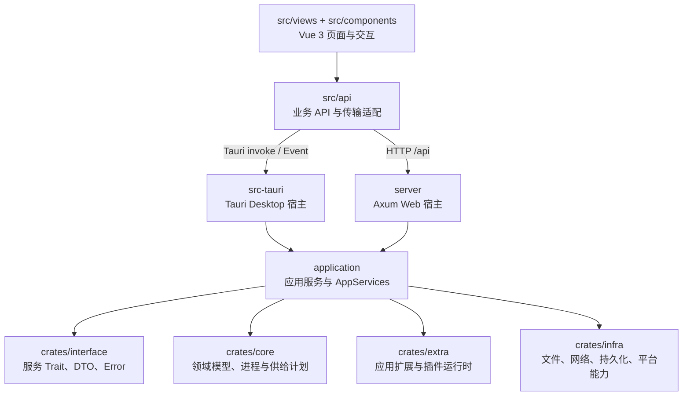

# 当前架构与代码组织

本文描述当前仓库的实际代码边界。它是给贡献者阅读源码和定位新功能的入口，不是迁移草案；如果实现发生变化，应在同一变更中更新本文。

## 运行拓扑



前端传输仍处于逐步收敛状态：`src/api/invoke.ts` 为已经接通的业务提供 Tauri 与 Axum 双模式分发，`src/api/tauri.ts` 仍承载一部分 Desktop-only 或尚未接通 Web 的旧包装器。浏览器模式遇到未注册的 Axum 路由会得到 `NotImplementedError`，不能把所有 `src/api` 方法都当成 Web 可用。

## Workspace 分层

| 路径               | 当前职责                                                                                         | 不应放入的内容                             |
| ------------------ | ------------------------------------------------------------------------------------------------ | ------------------------------------------ |
| `application`      | 装配 `Core*Service`、应用用例、插件策略和能力 dispatcher；`AppServices` 提供进程级的惰性服务容器 | Tauri command、Axum request 解析、Vue 逻辑 |
| `crates/core`      | 实例模型、生命周期、进程/终端、服务器检测和供给计划，以及插件能力与策略的传输无关类型            | 宿主状态、HTTP/Tauri 类型                  |
| `crates/extra`     | 备份、配置、Java、市场、在线隧道、更新、日志和 Lua 插件 loader/manager/engine                    | 宿主传输入口                               |
| `crates/infra`     | 文件系统、归档、下载、网络、代理、持久化和平台适配                                               | 业务用例和前端协议                         |
| `crates/interface` | 两个宿主共用的服务 Trait、DTO、枚举和错误契约                                                    | 路由注册、RPC handler、宿主生命周期        |
| `src-tauri`        | Desktop 进程入口、Tauri command/event、窗口、托盘、轻量模式和桌面文件/进程能力                   | Web server 实现                            |
| `server`           | Web 进程入口、Axum REST、插件 RPC、Vite dev/static SPA 组装和监听生命周期                        | Desktop 窗口与 Tauri 状态                  |
| `crates/vendor`    | 独立许可的 vendored crate，例如 `java-manager` 和 `sysproxy`                                     | 项目公共领域规则                           |

`crates/interface` 当前仍依赖部分 `core`/`extra` 模型，这是现状而不是“完全纯契约层”的完成声明。新增接口应先复用现有稳定模型；若要解除该依赖，必须单独设计 DTO 和迁移范围。

## 依赖与调用边界

当前主依赖方向是：

```text
src-tauri ─┐
           ├─> application ─> core / extra / infra
server  ───┘        └───────> interface

src-tauri / server ──────────> interface（宿主适配所需契约）
extra ───────────────────────> core / infra
interface ───────────────────> core / extra（当前模型依赖，待收敛）
```

必须保持的边界：

1. `src-tauri` 和 `server` 互不依赖；共享业务通过 `application` 和既有契约复用。
2. `application` 不依赖 Tauri、Axum 或 Vue；宿主差异在适配器中处理。
3. `core`、`extra`、`infra` 不接收 Tauri command 参数或 Axum request。
4. 新增普通业务优先使用资源式 REST 或直接的 Tauri command，不扩展成一个覆盖所有业务的 `method_id + JSON` runtime。
5. 插件能力可以使用显式的插件 RPC/Bridge；这不等于把普通业务改造成通用 RPC。

已知的边界缺口要写成明确状态，不通过文档假装已经完成：前端双宿主映射尚未覆盖所有旧 API，`interface` 的模型依赖尚未完全拆除，插件的详细授权与运行时边界见[插件设计](./plugin.md)。

## 宿主入口

### Desktop

`src-tauri/src/main.rs` 创建 Tauri builder，注册 `src-tauri/src/adapter/tauri/commands` 下的命令，初始化 `AppServices`，并设置窗口、托盘、日志转发和退出清理。桌面专用的文件选择、窗口材质、轻量模式和本地事件留在 `src-tauri/src/desktop` 或对应 adapter 中。

### Web

`server/src/main.rs` 初始化 `AppServices`，构建 Vite 配置并启动 Axum。`server/src/adapter/http/router.rs` 将 REST 路由挂在 `/api`，当前路由族包括实例与服务器生命周期、供给检查、设置、系统资源、定时任务、更新和下载；同一进程还提供 SPA 路由。插件能力调用是单独的 `/api/rpc/plugin/v2/invoke` RPC 路由，并有自己的 Bearer 认证边界。

默认 Web 监听地址是 `127.0.0.1:3000`。`SEALANTERN_SERVER_ADDR` 可完全覆盖地址，`SEALANTERN_SERVER_BIND_PUBLIC=1` 或 `true` 才会改变默认绑定策略。

## 新功能落位

### 共享业务

1. 在 `crates/interface` 复用或补充宿主共用的输入、输出、事件和错误契约。
2. 在 `application/src/service` 实现用例，并在 `application/src/services.rs` 装配服务。
3. 在 Desktop 和 Web 各自添加薄适配器，只负责传输和宿主上下文。
4. 在 `src/api` 暴露业务方法；只有已经有 Web 路由的能力才增加双模式映射。
5. 为服务层和宿主适配器分别补充针对其边界的测试。

### 宿主专用能力

窗口、托盘、文件对话框、原生进程能力和 Tauri 事件留在 Desktop；HTTP 监听、SPA/Vite 生命周期和 Web 认证留在 Web。不要为了目录对称而为另一宿主制造没有实际消费者的实现。

## 源码锚点

- [workspace Cargo.toml](../../Cargo.toml)
- [application service assembly](../../application/src/services.rs)
- [Desktop entry](../../src-tauri/src/main.rs)
- [Web entry](../../server/src/main.rs)
- [Web router](../../server/src/adapter/http/router.rs)
- [dual-transport frontend adapter](../../src/api/invoke.ts)
